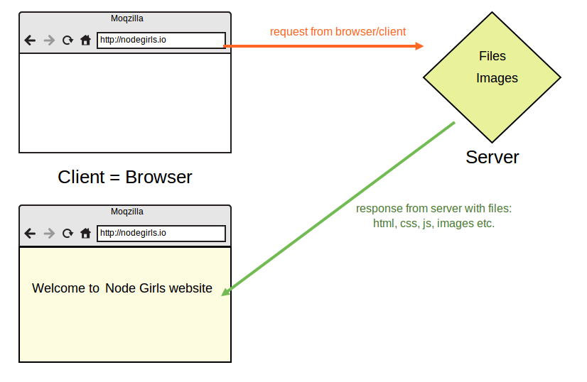

# Step 3: Building the server

The first thing we need to do is build our server. You will always need to build a server when writing back-end code. A server can be built in pure Node.js, but Express makes things easier for us.

### What is a server?

> Servers are computer programs that receive requests from other programs, the _clients_ and send back a response e.g share data, information or hardware and software resources.

#### ...and what is a server in plain English?

A server is a computer program. Its job is to send and receive data.

Let's take a website for example. A website is just a collection of HTML and CSS files, images, maybe some javascript files. When you type a website address in your browser's address bar, the browser \(client\) sends a [**request**](../keywords.md#request) to the server that lives at that address. The browser asks the server to give it the files it needs to display the website properly.




### 1. Create a `server.js` file

Let's build our server! Before we do anything, let's create a new file called `server.js`. This is where all our server code is going to live.

### 2. `require` the Express library

We already installed Express in Step 2, but we need to make sure it is included in this file specifically so we can make use of its methods. In Node.js, when you want to access the functionality of a library or [**module**](../keywords.md#module) in another file, you `require` it.

To import Express, write the following inside `server.js`:



```javascript
var express = require('express');
```



### 3. Initialise the server

To initialise our server, we just need to call the `express()` function. This will create an Express application for us to work with.

Add the second line of code to your `server.js` file:



```javascript
var express = require('express');
var app = express();
```



### 4. Start 'listening' for potential requests

One more step left, we need to set a [**port**](../keywords.md#port) for our server to listen to. Think of a port as a door number; any requests that come to the server will come via that door. Setting a port will allow us to find where our server is running.

We use the **`app.listen`** method to do this. This method takes two arguments: a **port** and a **callback function** telling it what to do once the server is running. Need clarification? Read more about the `app.listen` method in the [Express documentation](http://expressjs.com/en/4x/api.html#app.listen).

We're going to run our server on port `3000`, and call`console.log` in our callback function. Update your `server.js` file, calling the `app.listen` method:



```javascript
var express = require('express');
var app = express();

app.listen(3000, function () {
  console.log('Server is listening on port 3000. Ready to accept requests!');
});
```



### 5. Switch the server on!

You've built your server, but it isn't running yet. We need to run a command in the terminal to do this. We are going to use the `node` keyword to run the server file.

Type the following command in your terminal:



```bash
$ node server.js
```



If you see this, congratulations! You have built yourself a server!


